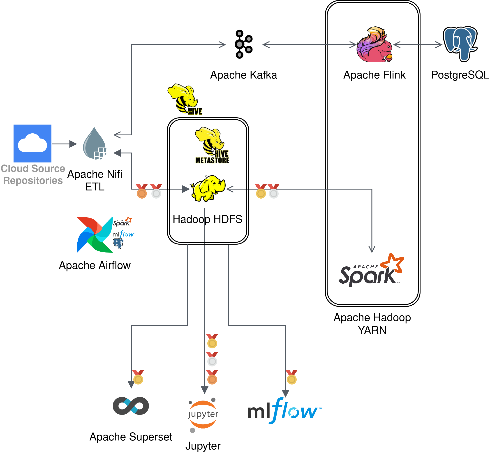
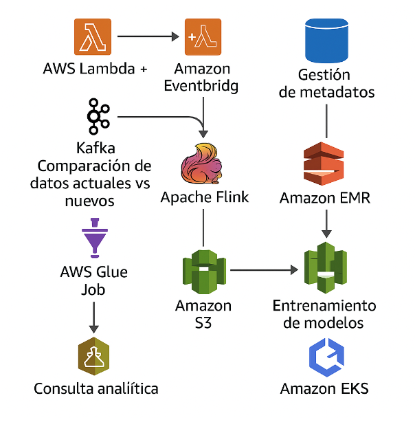

# Catalunya en Dades: Big Data Architecture for Open Data Management

## 📋 Project Overview

This project addresses the challenge of efficiently managing open data from [Dades obertes / Catalunya](https://analisi.transparenciacatalunya.cat) government portal. The data is updated at different frequencies (daily, monthly, annual), and there's no centralized mechanism to detect changes and manage updates efficiently.

### 🔍 Problem Statement

The solution we've designed allows for:

1. Monitoring multiple open datasets and detecting when new information is available
2. Downloading and storing data in an organized manner, ensuring only relevant changes are processed
3. Transforming and enriching data into formats ready for analysis and consumption by applications
4. Ensuring scalability and automation, allowing different users (data scientists, analysts, applications) to access processed data efficiently

## 🏗️ Architecture

Our Big Data architecture leverages several key components:

- **Apache NiFi**: Data ingestion and workflow orchestration
- **Apache Kafka**: Message broker for data streams
- **Apache Flink**: Stream processing framework
- **Apache Spark**: Distributed data processing
- **Hadoop HDFS**: Distributed storage
- **PostgreSQL**: Metadata management
- **Hive Metastore**: Schema management
- **Apache Airflow**: Workflow orchestration
- **MLflow**: Machine learning model management
- **Apache Superset**: Data visualization

### Data Quality Layers

The architecture implements a medallion approach:
- **Bronze**: Raw data as ingested from sources
- **Silver**: Cleansed, validated, and transformed data
- **Gold**: Enriched, aggregated data ready for analytics

## ☁️ Cloud Implementation

An equivalent cloud implementation has been designed using AWS services:

Key services include:
- AWS Lambda & EventBridge
- AWS Glue Job
- Amazon RDS (PostgreSQL)
- Amazon MSK (Managed Kafka)
- Amazon Kinesis Data Analytics
- Amazon EMR
- Amazon S3
- Amazon Athena
- Amazon SageMaker

## 📊 Key Value Proposition

This architecture addresses the 4Vs of Big Data:
- **Volume**: Scalable infrastructure for efficiently storing and processing large data volumes
- **Variety**: Flexible system for integrating and transforming diverse data formats
- **Veracity**: Automatic validations ensuring data quality and consistency
- **Value**: Generating enriched, high-quality datasets ready for analysis and machine learning

## 💻 Implementation Repositories

This project consists of multiple components. The implementation code for key processing engines can be found in these repositories:

- **Apache Flink Jobs**: [https://github.com/vmchura/FlinkJobs](https://github.com/vmchura/FlinkJobs)
- **Apache Spark Jobs**: [https://github.com/vmchura/SparkJobs](https://github.com/vmchura/SparkJobs)

